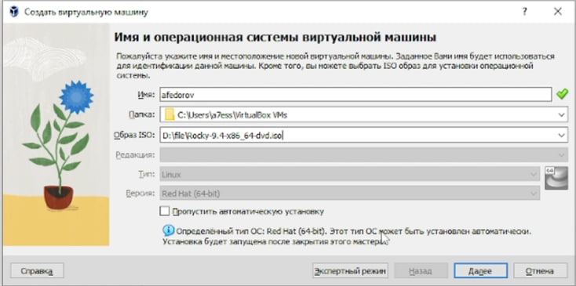

---
## Front matter
lang: ru-RU
title: Структура научной презентации
subtitle: Простейший шаблон
author:
  - Федоров Андрей
institute:
  - Российский университет дружбы народов, Москва, Россия

## i18n babel
babel-lang: russian
babel-otherlangs: english

## Formatting pdf
toc: false
toc-title: Содержание
slide_level: 2
aspectratio: 169
section-titles: true
theme: metropolis
header-includes:
 - \metroset{progressbar=frametitle,sectionpage=progressbar,numbering=fraction}
 - '\makeatletter'
 - '\beamer@ignorenonframefalse'
 - '\makeatother'
---

# Информация

## Докладчик

  * Федоров Андрей Андреевич
  * студент
  * НБИ 2 курс
  * Российский университет дружбы народов

# Вводная часть

## Актуальность

- Работа с Линукс

## Объект и предмет исследования

- Кали Линукс
- Виртуальная машина

## Цели и задачи

- Целью данной работы является приобретение практических навыков
установки операционной системы на виртуальную машину, настройки ми-
нимально необходимых для дальнейшей работы сервисов.

## Материалы и методы

- Процессор `pandoc` для входного формата Markdown
- Результирующие форматы
	- `pdf`
	- `html`
- Автоматизация процесса создания: `Makefile`

# Создание презентации

## Процессор `pandoc`

- Pandoc: преобразователь текстовых файлов
- Сайт: <https://pandoc.org/>
- Репозиторий: <https://github.com/jgm/pandoc>

## Формат `pdf`

- Использование LaTeX
- Пакет для презентации: [beamer](https://ctan.org/pkg/beamer)
- Тема оформления: `metropolis`

## Код для формата `pdf`

```yaml
slide_level: 2
aspectratio: 169
section-titles: true
theme: metropolis
```

## Формат `html`

- Используется фреймворк [reveal.js](https://revealjs.com/)
- Используется [тема](https://revealjs.com/themes/) `beige`

## Код для формата `html`

- Тема задаётся в файле `Makefile`

```make
REVEALJS_THEME = beige 
```
# Результаты

## Получающиеся форматы

- Полученный `pdf`-файл можно демонстрировать в любой программе просмотра `pdf`
- Полученный `html`-файл содержит в себе все ресурсы: изображения, css, скрипты

# Элементы презентации

## Актуальность

- Даёт понять, о чём пойдёт речь
- Следует широко и кратко описать проблему
- Мотивировать свое исследование
- Сформулировать цели и задачи
- Возможна формулировка ожидаемых результатов

## Цели и задачи

- Не формулируйте более 1--2 целей исследования

## Материалы и методы

- Представляйте данные качественно
- Количественно, только если крайне необходимо
- Излишние детали не нужны

## Содержание исследования

- Я выполняю лабораторную работу на домашнем оборудовании, поэтому создаю новую виртуальную машину в VirtualBox, выбираю имя, местоположение  и образ ISO, устанавливать будем операционную систему Rocku DVD (рис. 1).

{#fig:001 width=70%}

Предварительно выбираю имя пользователя и имя хоста (рис. 2).

{#fig:002 width=70%}

Выставляю основной памяти размер 2048 Мб, выбираю 3 процессора, чтобы ничего не висло (рис. 3).

## Содержание исследования

{#fig:003 width=70%}

Соглашаюсь с проставленными настройками (рис. 5).

{#fig:004 width=70%}

Начинается загрузка операционной системы (рис. 6).

{#fig:006 width=70%}

## Содержание исследования

При этом должен быть подключен в носителях образ диска! (рис. 7).

{#fig:007 width=70%}

Выбираю язык установки (рис. 8).

{#fig:008 width=70%}

В обзоре установки будем проверять все настройки и менять на нужные (рис. 9).

{#fig:09 width=70%}

## Содержание исследования

Установил пароль для администратора (рис. 12).

{#fig:010 width=70%}

Для пользователя так же сделал пароль и сделал этого пользователя администратором (рис. 13).

{#fig:011 width=70%}

## Содержание исследования

После установки при запуске операционной системы появляется окно выбора пользователя (рис. 19).

{#fig:012 width=70%}

## Результаты

- Я приобрел практические навыки
установки операционной системы на виртуальную машину, настройки ми-
нимально необходимых для дальнейшей работы сервисов.


## Итоговый слайд

- Я провел работу с установкой кали линукс

