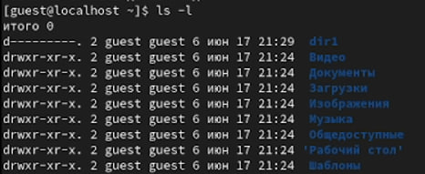

---
## Front matter
lang: ru-RU
title: Структура научной презентации
subtitle: Простейший шаблон
author:
  - Федоров Андрей
institute:
  - Российский университет дружбы народов, Москва, Россия

## i18n babel
babel-lang: russian
babel-otherlangs: english

## Formatting pdf
toc: false
toc-title: Содержание
slide_level: 2
aspectratio: 169
section-titles: true
theme: metropolis
header-includes:
 - \metroset{progressbar=frametitle,sectionpage=progressbar,numbering=fraction}
 - '\makeatletter'
 - '\beamer@ignorenonframefalse'
 - '\makeatother'
---

# Информация

## Докладчик

  * Федоров Андрей Андреевич
  * студент
  * НБИ 2 курс
  * Российский университет дружбы народов

# Вводная часть

## Цели и задачи

- Получение практических навыков работы в консоли с атрибутами файлов, закрепление теоретических основ дискреционного разграничения доступа в современных системах с открытым кодом на базе ОС Linux

## Материалы и методы

1. Работа с атрибутами файлов
2. Заполнение таблицы "Установленные права и разрешённые действия" (см. табл. 2.1)
3. Заполнение таблицы "Минимальные права для совершения операций" (см. табл. 2.2)

## Содержание исследования

- 1. В операционной системе Rocky создаю нового пользователя guest через учетную запись администратора (рис. 1).

{#fig:001 width=70%}

## Содержание исследования

2. Далее задаю пароль для созданной учетной записи (рис. 2).

{#fig:002 width=70%}

## Содержание исследования

3. Сменяю пользователя в системе на только что созданного пользователя guest (рис. 3).

{#fig:003 width=70%}

## Содержание исследования

4. Определяю с помощью команды pwd, что я нахожусь в директории /home/guest/. Эта директория является домашней, ведь в приглашении командой строкой стоит значок ~, указывающий, что я в домашней директории (рис. 4).

{#fig:004 width=70%}

## Содержание исследования

5. Уточняю имя пользователя (рис. 5)

{#fig:005 width=70%}

## Содержание исследования

6. В выводе команды groups информация только о названии группы, к которой относится пользователь. В выводе команды id можно найти больше информации: имя пользователя и имя группы, также коды имени пользователя и группы  (рис. 6)

{#fig:006 width=70%}

## Содержание исследования

7. Имя пользователя в приглашении командной строкой совпадает с именем пользователя, которое выводит команда whoami (рис. 7)

{#fig:007 width=70%}

## Содержание исследования

8. Получаю информацию о пользователе с помощью команды 
```
cat /etc/passwd | grep guest
```

В выводе получаю коды пользователя и группы, адрес домашней директории (рис. 8).

{#fig:008 width=70%}

9. Да, список поддиректорий директории home получилось получить с помощью команды ls -l, если мы добавим опцию -a, то сможем увидеть еще и директорию пользователя root. Права у директории:

root: drwxr-xr-x,

evdvorkina и guest: drwx------ (рис. 9).

{#fig:009 width=70%}

## Содержание исследования

10. Пытался проверить расширенные атрибуты директорий. Нет, их увидеть не удалось (рис. 10). Увидеть расширенные атрибуты других пользователей, тоже не удалось, для них даже вывода списка директорий не было.

{#fig:010 width=70%}

## Содержание исследования

11. Создаю поддиректорию dir1 для домашней директории. Расширенные атрибуты командой lsattr просмотреть у директории не удается, но атрибуты есть: drwxr-xr-x, их удалось просмотреть с помощью команды ls -l (рис. 11).

{#fig:011 width=70%}

12. Снимаю атрибуты командой chmod 000 dir1, при проверке с помощью команды ls -l видно, что теперь атрибуты действительно сняты (рис. 12).
 
{#fig:012 width=70%}

## Содержание исследования

13. Попытка создать файл в директории dir1. Выдает ошибку: "Отказано в доступе" (рис. 13). 

{#fig:013 width=70%}

## Содержание исследования

Вернув права директории и использовав снова командy ls -l можно убедиться, что файл не был создан (рис. 14). 

{#fig:014 width=70%}

## Результаты

- Были получены практические навыки работы в консоли с атрибутами файлов, закреплены теоретические основы дискреционного разграничения доступа в современных системах с открытым кодом на базе ОС Linux.


## Итоговый слайд

- Запоминается последняя фраза. © Штирлиц
- Главное сообщение, которое вы хотите донести до слушателей
- Избегайте использовать последний слайд вида *Спасибо за внимание*
